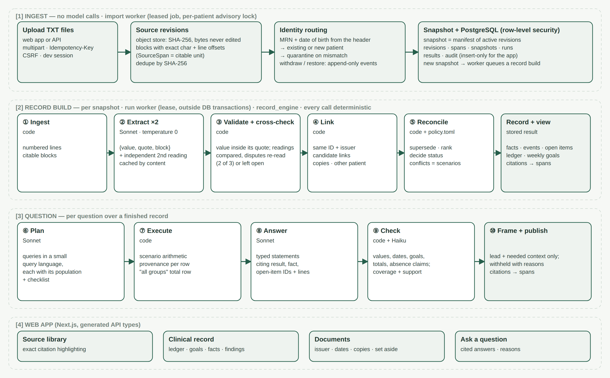

# Auditable clinical abstraction and question answering

This project turns 31 synthetic outpatient records (`documents/`, patient Rowan Mercer, January
2026) into an **auditable clinical record** and answers questions about it. **Every figure in an
answer is computed by code, and every statement links to the source lines it rests on.**

- **Extraction:** a model reads each document **twice**, recording only what the document says,
  with an exact quote for every value.
- **Decisions and calculations:** code under a readable policy file links the documents,
  reconciles what they say and does every calculation. Conflicts are kept, never averaged.
- **Answers:** each question compiles to queries over the record, and the answer is checked by
  code before it is published.

| | |
|---|---|
| Record | 12 therapy sessions (5 individual, 5 group, 2 family) on 11 days · 585 **or** 595 minutes (one unresolved conflict) · weekly goal: not met, not met, met, cannot be determined |
| Development benchmark (65 questions) | 65/65 published · judge factual **119/130** · 55/65 fully correct · exact calculations **4/4** (55/55 fields) |
| DEV-01 to DEV-05 (current code, one cold run) | 5/5 published (4 answered, 1 partial) · factual 2 and evidence 2 on all five (three wording errors the judge missed; see below) · 47–76 s each, within the 90 s budget · $0.84 in total |
| Held-out set (15 questions) | 15/15 published · judge factual **26/30** (27/30 on a later regrade) |
| Stability | A second build from scratch gives an **identical** episode ledger |
| Tests | 144 automated tests without model calls, plus 2 browser tests |

## Contents

- [What is submitted, and where](#what-is-submitted-and-where)
- [Quick start](#quick-start)
- [Approach](#approach)
- [Results](#results)
- [Checks and experiments](#checks-and-experiments)
- [One observed limitation, and how to investigate it next](#one-observed-limitation-and-how-to-investigate-it-next)
- [Limitations and future work](#limitations-and-future-work)
- [Models, settings, runtime and cost](#models-settings-runtime-and-cost)
- [Coding assistance](#coding-assistance)
- [Repository map](#repository-map)

## What is submitted, and where

| Requirement | Where |
|---|---|
| **1. Runnable code and setup** | `record_engine/` (the engine), `services/clinical/` (API, worker, database), `apps/web/` (web app). Setup: [Quick start](#quick-start) below; full details in [docs/operations.md](docs/operations.md) |
| **2. Complete clinical abstraction** | [`submission/abstraction.md`](submission/abstraction.md) is the readable record: encounter ledger, weekly goal results, every fact by event and open items, each value linked to its source lines. [`submission/abstraction.json`](submission/abstraction.json) holds every fact with its status, rule and quoted evidence. [`submission/observations.jsonl`](submission/observations.jsonl) holds what was extracted from each document |
| **2. Execution logs** | [`submission/logs/run.log`](submission/logs/run.log) covers the submitted run: extraction, build, 65 answers, grading, scoring, stability, held-out. [`submission/logs/dev01-05_run.log`](submission/logs/dev01-05_run.log) covers the cold re-run of DEV-01 to DEV-05 on the current code, and [`submission/logs/dev01-05_trace.md`](submission/logs/dev01-05_trace.md) traces each of those questions: plan, queries, results, check rounds, repairs, time and cost. [`submission/run_stats.json`](submission/run_stats.json) and [`submission/extraction_stats.json`](submission/extraction_stats.json) give cost and time per question and per document |
| **2. Answers to the five development questions, with sources** | [`submission/dev01-05_answers.md`](submission/dev01-05_answers.md) lists each statement of the current code's answers with its source lines, plus the judge's grade ([`logs/dev01-05_answers.json`](submission/logs/dev01-05_answers.json) is the full output). [`submission/answers.md`](submission/answers.md) and [`answers.json`](submission/answers.json) hold all 65 answers of the benchmark run, DEV-01 to DEV-05 first, with every query result and check |
| **3. README** | This file. The per-question benchmark results are in [`submission/benchmark/README.md`](submission/benchmark/README.md) |

## Quick start

**Requirements:** Python 3.13, [uv](https://docs.astral.sh/uv/), Node 24, Docker (or PostgreSQL
16), and an Anthropic API key.

```sh
make setup      # install locked Python and Node dependencies; create .env with a session secret
                # then add EHR_ANTHROPIC_API_KEY=... to .env (server-side only)
make db         # start PostgreSQL (Docker)
make migrate    # create the schema
make dev        # web app http://localhost:3000 · API docs http://127.0.0.1:8008/docs
```

**Web application:**

1. Open http://localhost:3000, choose **Enter development workspace** and upload the 31 TXT files
   from `documents/`. They are routed to their patient by MRN and date of birth, and the case
   opens.
2. The worker builds the record in the background, in about 7 minutes cold. Unchanged documents
   come from the cache after that.
3. Three views are then available:
   - **Clinical record:** sessions, days, minutes, weekly goals, the encounter ledger and open
     items.
   - **Documents:** what each document is, and whether it is a copy or was set aside.
   - **Ask a question:** cited answers.

   Every value links to its source lines.

**Engine only (no database):** reproduces the submitted outputs straight from `documents/`.

```sh
make evaluate   # extraction + record + 65 answers + judge + metrics + stability -> submission/
make heldout    # 15 held-out questions, graded separately
make scenarios  # 13 changed-input scenarios
make test       # unit and engine tests, no model calls
make integration                     # service tests against PostgreSQL (after make db)

.venv/bin/python -m record_engine ask --questions FILE --out DIR     # any question file
.venv/bin/python -m record_engine add NEW.txt                        # add a document, report changes
.venv/bin/python -m record_engine trace HG-E115 --out submission     # fact -> rule -> evidence -> lines
```

Model outputs are cached by everything that shapes them, so a re-run pays only for what changed.

## Approach



The record has four layers:

- **Observations:** what one document says, each value with its quote.
- **Events:** visits, measurements, goals and so on, linked across documents.
- **Facts:** one decided value per event and field, with a status and a rule.
- **Open items:** what is unresolved.

The model only reads. **Code decides and computes.**

| Stage | Done by | What happens |
|---|---|---|
| 1. Ingest | code | Numbered lines and citable blocks (paragraphs, table rows) per document |
| 2. Extract | Sonnet, temperature 0 | Observations as `{value, quote, block}`. The prompt is generated from the policy's observation kinds and fields |
| 2′. Cross-check | Sonnet ×2, code | Every document is read a second time, independently. Code compares the key fields of every event. A disagreement gets one focused re-read and is settled when two of three readings agree, otherwise it stays an open item. A re-read that contradicts both readings is rejected |
| 3. Validate and sweep | code | A value must appear inside its own quote, so no subtraction and no unstated date can pass. Every time, date, duration, ID and score in the text must be covered, and uncovered mentions get one targeted re-extraction |
| 4. Link | code | Same visit ID and issuer make one event. Otherwise a weighted match (date, service, time, participants) links observations at 0.8 or above; matches from 0.5 to 0.8 are reported as candidates, never merged. Copies are detected; a note naming another patient is set aside |
| 5. Reconcile | code + `policy.toml` | Per event and field, four steps: keep only admissible evidence; let a correction supersede only the fields it names; rank signed over unsigned over draft, and recorded at the time over later; decide documented / corroborated / established / conflicting. Conflicts stay as scenarios (40 **or** 50 minutes). Minutes are patient presence minus breaks and gaps |
| 6–7. Plan and execute | Sonnet, code | Queries in a small query language, each stating its population, plus a checklist. Code runs them with scenario arithmetic and records provenance for every row |
| 8. Write | Sonnet | Typed statements (value, conflict, missing, inference, narrative) citing results, facts and source passages |
| 9. Check | code, then Haiku | See below |
| 10. Frame | Haiku + code | Orders the checked statements that answer the question and holds back the rest. Statements are never rewritten |

**Stage 9 in detail.**

- **Code checks:**
  - every number and time is bound to a cited value;
  - required totals are present;
  - goal outcomes are right per threshold;
  - weekdays match their dates;
  - a count that introduces a list matches the items listed;
  - conflict status is respected;
  - every "not documented" claim is verified against the facts and the sources.
- **The small model (Haiku) checks:** question parts, checklist coverage, populations, and support
  for reasons and document descriptions.
- **Repair:**
  - code repairs what it can prove;
  - a population mismatch re-plans the question once, and up to two model repairs follow;
  - statements still flagged are removed, never rewritten;
  - each answer has a 90-second budget.

Nothing in the code is specific to this patient or specialty. All domain knowledge (observation
kinds, precedence, service vocabulary, counting rules) is in
[`record_engine/policy.toml`](record_engine/policy.toml), and a test prevents patient or clinic
names in engine code. [`record_engine/README.md`](record_engine/README.md) describes every stage
and check. The architecture decisions are in [`docs/adr/`](docs/adr/).

## Results

### How the evaluation sets were built

**Development benchmark:** 65 questions. The five example questions are kept word for word as
DEV-01 to DEV-05, and 60 more were written from the documents. Each question has:

- a reference answer;
- the required facts;
- the failure modes it targets (a document counted as a visit, a charge treated as attendance, a
  duplicate on the same day, a conflict averaged away);
- source excerpts with line ranges;
- for aggregate questions, a structured answer scored field by field.

The set spans 9 easy, 29 medium and 27 hard questions. A reference ledger fixes the anchors: 12
sessions, 11 days, 585 or 595 minutes, weeks not met / not met / met / cannot determine. Only the
evaluator reads the gold data; the engine never does.

**Held-out set:** 15 questions in the same format, kept out of development and graded separately.

| Evaluation | Question it answers | Size | Graded by |
|---|---|---|---|
| Offline tests | Do the rules, arithmetic and checks behave as specified? | 144 tests | pytest, no model calls |
| Development benchmark | Are answers correct, complete and well cited? | 65 questions | Deterministic scorer + blind model judge |
| Held-out set | Did we overfit to the benchmark? | 15 questions | Same judge and rubric, separately |
| Stability | Is the record reproducible? | Full rebuild from scratch | Fact-by-fact comparison of two builds |

### Development benchmark (65 questions, engine 0.3, policy-2)

| Measure | Result |
|---|---|
| Published | 65/65 (63 answered, 2 partial) |
| Judge factual (0–2) | **119/130** (mean 1.83; 95% interval 1.72–1.92, exploratory) |
| Fully correct (factual 2) | 55/65 |
| Judge evidence (0–2) | 1.92 |
| Exact calculations | 4/4 questions, 55/55 structured fields |
| Citations, micro precision / recall / F1 | 0.61 / 0.43 / 0.50 |
| Citations, macro precision / recall / F1 | 0.71 / 0.53 / 0.56 |
| ROUGE-1 / ROUGE-2 / ROUGE-L · BLEU-4 (secondary) | 0.35 / 0.13 / 0.23 · 0.052 |

**How to read these scores:**

- **ROUGE and BLEU are low** because answers are worded differently from the references, not
  because they are wrong: a fully correct answer can have near-zero BLEU. They are reported for
  completeness only.
- **Citation recall is the weaker side.** Answers cite the lines behind each statement, while the
  gold set includes every block that overlaps a gold passage.

### The five development questions

The benchmark run above came before the 90-second answer budget and the last answer-check fixes.
The five questions were then answered again by the current code, cold (no cached model output),
and graded by the same judge ([`dev01-05_answers.md`](submission/dev01-05_answers.md),
[`logs/dev01-05_run.log`](submission/logs/dev01-05_run.log)):

| Question | Answer in brief | Factual | Evidence | Time | Cost |
|---|---|---|---|---|---|
| DEV-01 sessions by type and days | 12 sessions (5 individual, 5 group, 2 family) on 11 days, with the records that could inflate the count (published as partial, see below) | 2 | 2 | 59 s | $0.21 |
| DEV-02 minutes and hours by week | 585 or 595 min (9 h 45 or 9 h 55); weeks 140 / 120 / 180 / 145 or 155 | 2 | 2 | 54 s | $0.14 |
| DEV-03 weekly goal | ≥3 days and ≥150 min per week: not met / not met / met / cannot be determined | 2 | 2 | 47 s | $0.13 |
| DEV-04 January 19 and 21 | Jan 19: 2 contacts, 90 min (the correction to 11:15 applied); Jan 21: 1 contact, 45 min (video gap excluded) | 2 | 2 | 74 s | $0.14 |
| DEV-05 symptom course | PHQ-9 18 → 14 → 10 (three distinct administrations), the reason for the Jan 19 add-on, the January 26 import as a copy of the January 16 form | 2 | 2 | 76 s | $0.22 |

All five were published in one run, in 47–76 s each (median 59 s), for $0.84 in total, with no
statement removed. DEV-01 was published as partial because its answer described the January 8 outreach call without citing that record, so the check could not verify it and the 90-second budget left no time for a repair; the fix is for code to add the missing citation when a statement describes a listed record it did not cite.

**Wording errors the judge missed.** A manual read of these five answers found three errors that
change no number, and all three still scored full marks:

- DEV-01 says eight encounters "were attended but excluded", but the list includes two no-shows and
  two cancellations.
- DEV-05 says "Rowan and the patient both reported"; Rowan is the patient.
- DEV-02 calls both January 26 notes "primary clinical records"; BH-D111 is the participating
  clinician's record.

This is why the judge's scores are treated as advisory.

**Against the benchmark run,** the two lost points are fixed: DEV-01 no longer adds a count that
includes medication visits, and DEV-05 now says that the January 26 import repeats the January 16
form. The slowest answer fell from 152 s to 70 s.

### Held-out set (15 questions)

15/15 published; judge factual **26/30**, evidence 1.60. The four lost points:

- **HO-03** counted the coordination call among the appointments not delivered.
- **HO-05** left out the 15 minutes with the partner alone on January 30.
- **HO-06** was marked down for naming the January 19 individual clinician, who is correctly named
  in BH-D105 (a grader error).
- **HO-10** gave the day count without listing the days.

After these results were known, the set was regraded with the same evidence the development judge
sees, which gave 27/30 (evidence 1.87). The first grading is the result reported here.

HO-02 informed an earlier fix, so the set is not fully held out.

### Stability

The record was rebuilt from scratch, with every model call fresh, and compared with the submitted
build.

- **Episode ledger:** identical. That covers every count, total, weekly result and encounter
  contribution.
- **Other facts:** 22 of 402 non-text facts differ, and none of them is counted anywhere. They are
  mostly administrative contacts that one build recorded and the other did not.
- **Disagreements between the two readings:** 40 in the main build. A focused re-read settled 30,
  and 10 remain open items, mostly outreach-call dates and times.

### What didn't work

| Problem | Where it shows | Cause |
|---|---|---|
| Answers include the wrong detail | DEV-19, 31, 49, 56, 58, 59, 60 (1 point each; DEV-01 and 05 also lost one in the benchmark run, fixed since); HO-03, 05, 06 | The writer adds context the question did not ask for, leaves out a fact the reference expects, or applies a statement to the wrong date or week |
| Linking question answered from the wrong view | DEV-61 (0 points) | Listed the unresolved candidate links instead of each encounter's linked documents |
| Low citation recall | 0.43 micro | Answers cite only what each statement needs |
| Unfamiliar value formats | Dates and times in words or compact timestamps ("half past two", 202601291400) | The validator reads only numeric date and time formats, so such values are rejected rather than read |
| Goal replacement ignores attestation | Goal handling | An unsigned draft plan can replace a signed goal |

Every lost point is listed in [`submission/benchmark/README.md`](submission/benchmark/README.md).

## Checks and experiments

- **Automated tests (144, no model calls; plus 2 Playwright browser tests):**

  | Group | Count | What they cover |
  |---|---|---|
  | Engine | 102 | Stage tests on the real record and on a synthetic physical-therapy patient with other ID formats and week starts; metamorphic tests; changed-input tests; answer-check tests; cross-check and framing tests with fake readings |
  | Service unit | 12 | Service unit tests |
  | Integration | 30 | Against real PostgreSQL with row-level security: record builds, answers, leases and automatic rebuilds, with the model steps replaced by fakes |

  The metamorphic tests change the real record the way records differ (a correction removed, a
  copy added, a signature time removed) and check the result changes exactly as expected.
- **Static checks:** ruff, mypy (strict), TypeScript and Prettier.
- **Stability experiment:** `make evaluate` rebuilds the record from scratch and compares it fact
  by fact (`submission/benchmark/stability.json`).
- **Changed-input scenarios** (13, run on engine 0.2): a late-entry addendum, a CSV export, an
  e-mail correction, an OCR-damaged draft, a remittance line, another patient's note, a reused
  visit number at another clinic, a plan amendment, a JSON call log, a re-imported form and more.
  Results: record checks 30/30, answers published 14/14, answer checks 13/14, judge 26/28
  (`submission/benchmark/scenarios_report.md`).
- **Leakage guard:** gold answers are read only by the evaluator and the held-out grader. A test
  keeps patient and clinic names out of engine code and the service.

## One observed limitation, and how to investigate it next

**One extraction is a sample, and a benchmark on one sample overstates stability.**

- **What happened:** a fresh extraction on another machine read an appointment export's issuer as
  "…Behavioral Health | Appointment desk". The rule that separates two organisations sharing a
  visit number then split five visits in two, giving **17 sessions instead of 12**.
- **Other silent differences:** the same comparison showed a therapist's session start taken for
  the patient's arrival, and a no-show read as attended.
- **Why the benchmark missed it:** it had measured only one extraction.

**What changed:**

- every call runs at temperature 0 except the independent second reading;
- every document is read twice and compared by code, and disagreements are re-read or left open;
- a department named after an organisation is the same issuer;
- partial attendance and arrival are derived from the times.

A rebuild from scratch now gives an identical ledger.

**What remains:** an error both readings share is not caught by comparing them.

**How to investigate it next:**

1. Run the stability check several times, and on the changed-input scenarios. Report the
   distribution of differing facts, not one comparison.
2. For fields that feed counts (status, presence, service, IDs), add cross-checks derived by code
   wherever the record allows one, as already done for partial attendance and arrival times.
3. Review the 10 open reading disagreements with a clinician, to see which ones the re-read should
   have settled.

## Limitations and future work

The largest open question is **generality**. Everything was built and tested on one synthetic
patient in one specialty. The most valuable next step is a second, independently written record
set, with references adjudicated by a clinician.

**Limitations:**

- **Policy scope:** the policy was written for outpatient behavioural health.
- **Link weights:** set by hand, not estimated.
- **Extraction can miss:** a fact stated in prose without numbers can be missed.
- **Reviewer noise:** the model reviewer both misses problems and invents them.
- **Input format:** text only.
- **Answer length:** answers can be longer than a clinician wants.
- **Evaluation depth:** one model judge, one run per version, and references written by the
  engine's author.

**Future work:**

- widen the value parser and make goal replacement respect attestation;
- cite the lines behind every fact a statement depends on, to raise recall;
- check statements against the question's named events and dates;
- run a second synthetic patient end to end;
- clinician-adjudicated references, three graded runs to measure judge noise, and a judge from
  another model family;
- read CSV, JSON and HL7 with code, so that only prose needs a model;
- a smaller fine-tuned extractor trained on the system's own validated observations.

Reconciliation rules and arithmetic stay in code, so every answer remains traceable.

## Models, settings, runtime and cost

**Models:**

| Model | Used for |
|---|---|
| `claude-sonnet-4-6` | Extraction, both readings and the re-read, planning, answers and repairs, and the benchmark judge |
| `claude-haiku-4-5-20251001` | Answer review, framing and absence checks |

**Settings:**

- Temperature 0 for every call except the independent second reading of each document
  (temperature 1).
- Structured JSON output through a forced tool call, validated locally.
- Outputs cached by a hash of model, prompts, schema, settings and trial.
- A 90-second budget per answer.

| Step | Cold cost | Time |
|---|---|---|
| Extraction with cross-check, 31 documents (two readings, 12 re-reads) | $3.92 | ≈ 7 min with 6 workers |
| Build the record | $0 (code) | < 1 s |
| 65 benchmark questions | $12.58 (≈ $0.19 each) | median 42 s, max 152 s per question (before the budget) |
| DEV-01 to DEV-05, current code | $0.84 (≈ $0.17 each) | median 59 s, max 76 s per question |
| 15 held-out questions | $2.12 | median 31 s, max 69 s |
| Stability check (second build) | $3.84 | ≈ 7 min |
| 13 changed-input scenarios | $2.96 | — |

Costs use list prices (Sonnet $3 / $15, Haiku $1 / $5 per million input / output tokens). Every
answer carries its own calls, tokens, cost and seconds (`answers.json`, `run_stats.json`).

## Coding assistance

Built with Anthropic Claude (Cowork, `claude-opus-5-5`): the record engine, its checks, the API
and web integration, the evaluation, and these documents. All changes are covered by the test
suite and were validated on live runs.

## Repository map

| Path | Contents |
|---|---|
| `record_engine/` | The engine: `ingest`, `extract`, `crosscheck`, `validate`, `link`, `reconcile`, `query`, `qa`, `render`, `evaluate`. [README](record_engine/README.md) |
| `record_engine/policy.toml` | All domain rules: observation kinds, precedence, services, counting, goals |
| `record_engine/heldout/`, `record_engine/scenarios/` | Held-out questions (references read only by their grader); changed-input scenarios |
| `services/clinical/` | FastAPI API, worker, PostgreSQL models and migrations (row-level security) |
| `apps/web/` | Next.js web application |
| `clinical_qa_benchmark/` | The 65-question benchmark and its gold data (read only by the evaluator) |
| `documents/` | The 31 source documents |
| `submission/` | Abstraction, answers, logs, stats and benchmark results |
| `docs/` | [Operations guide](docs/operations.md), [ADRs](docs/adr/), system diagram |
| `tests/` | Service unit, integration and browser tests |

**Not production-ready:**

- The app is locked to development mode: a development sign-in (no OIDC) and local object
  storage.
- There is no reviewer sign-off on facts or answers.
- Every result comes from one synthetic patient.
